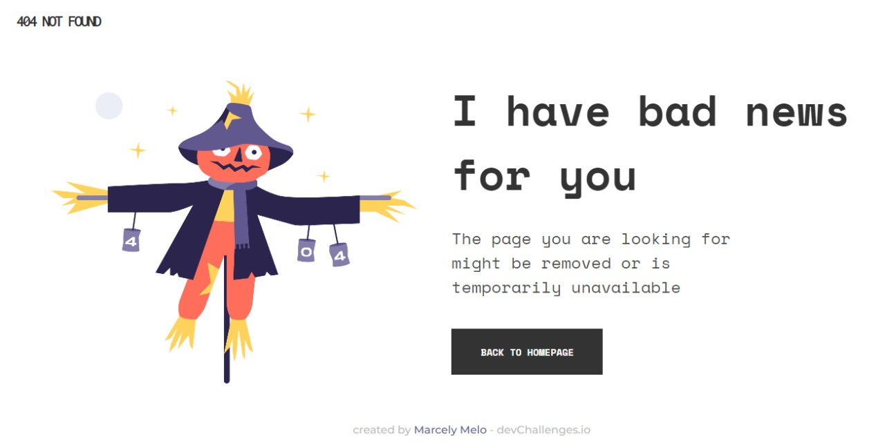

<!-- Please update value in the {}  -->

<h1 align="center">404 NOT FOUND CHALLENGE</h1>

   Solution for a challenge from  <a href="http://devchallenges.io" target="_blank">Devchallenges.io</a>.

  <h3>
    <a href="https://marcelymelo.github.io/404-page-challenge/">
      Demo
    </a>
     | 
    <a href="https://github.com/MarcelyMelo/404-page-challenge">
      Solution
    </a>
     | 
    <a href="https://devchallenges.io/challenges/wBunSb7FPrIepJZAg0sY">
      Challenge
    </a>
  </h3>

<!-- TABLE OF CONTENTS -->

## Table of Contents

- [Overview](#overview)
  - [Built With](#built-with)
- [Features](#features)
- [Contact](#contact)
- [Acknowledgements](#acknowledgements)

<!-- OVERVIEW -->

## Overview

This project is very simple, but it helped me understand Media Querie, more about pseudo-classes, flexbox and I learned how to host a live website. By doing this project, I greatly increased my knowledge of HTML and CSS.

### Built With

<!-- This section should list any major frameworks that you built your project using. Here are a few examples.-->

- [HTML](https://pt.wikipedia.org/wiki/HTML)
- [CSS](https://pt.wikipedia.org/wiki/CSS)

## Features

<!-- List the features of your application or follow the template. Don't share the figma file here :) -->

This application/site was created as a submission to a [DevChallenges](https://devchallenges.io/challenges) challenge. The [challenge](https://devchallenges.io/challenges/wBunSb7FPrIepJZAg0sY) was to build an application to complete the given user stories.

## Acknowledgements

<!-- This section should list any articles or add-ons/plugins that helps you to complete the project. This is optional but it will help you in the future. For exmpale -->

- [This site helps me understand Media-Queries](https://developer.mozilla.org/pt-BR/docs/Web/CSS/Media_Queries/Using_media_queries)
- [This site helps me understand pseudo-classes](https://www.w3schools.com/css/css_pseudo_classes.asp)
- [This site helps me understand and pratice flexbox](https://www.w3schools.com/css/css3_flexbox.asp)

## Contact

<!-- - Website [your-website.com](https://{your-web-site-link}) -->
- GitHub [@MarcelyMelo](https://github.com/MarcelyMelo)
- Linkedin [@MarcelyMelo](https://www.linkedin.com/in/marcelymelo/)
